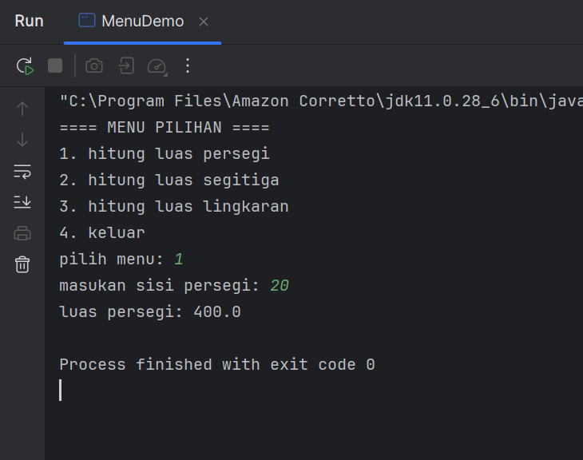

# Laporan Modul 2: Dasar Pemrograman Java
**Mata Kuliah:** Praktikum Pemrograman Berorientasi Objek   
**Nama:** [Ibra Khalid Londang]  
**NIM:** [2024573010115]  
**Kelas:** [TI 1A]

---

# 1. Abstrak
Modul ini dirancang untuk memberikan pemahaman dasar tentang pemrograman Java melalui praktikum langsung. Setiap praktikum dilengkapi dengan teori dasar dan langkah-langkah implementasi yang detail.

---
# 2. Praktikum
---
## Praktikum 1 - Variabel dan Tipe Data

### Dasar Teori

Java memiliki dua kategori tipe data:

### Tipe Data Primitif
- byte: 8-bit signed integer (-128 to 127)
- short: 16-bit signed integer (-32,768 to 32,767)
- int: 32-bit signed integer (-2,147,483,648 to 2,147,483,647)
- long: 64-bit signed integer
- float: 32-bit IEEE 754 floating point
- double: 64-bit IEEE 754 floating point
- boolean: true atau false
- char: 16-bit Unicode character

### Tipe Data Reference
- String, Array, Object, dll.

### Aturan Penamaan Variabel
- Dimulai dengan huruf, underscore (_), atau dollar sign ($)
- Tidak boleh dimulai dengan angka
- Case sensitive
- Tidak boleh menggunakan keyword Java


## Langkah Praktikum

### Langkah 1: Variabel dan tipe data

- Buat file baru dengan nama VariabelDemo.java
- Ketik kode berikut:

```declarative
package modul_2;

public class VariabelDemo {
    public static void main(String[] args) {
        int umur = 19;
        double tinggi = 175;
        char grade = 'B';
        boolean lulus = true;
        String nama = "Ibra Khalid Londang";

        System.out.println("Nama: " + nama);
        System.out.println("Umur: " + umur + "tahun");
        System.out.println("Tinggi: " + tinggi + "cm");
        System.out.println("Grade: " + grade);
        System.out.println("Lulus: " + lulus);

        int a = 10;
        int b = 3;

        System.out.println("\n==== operasi aritmatika====");
        System.out.println("a= " + a);
        System.out.println("b= " + b);
        System.out.println("a + b = " + (a+b));
        System.out.println("a - b = " + (a-b));
        System.out.println("a * b = " + (a*b));
        System.out.println("a / b = " + (a/b));
        System.out.println("a % b = " + (a%b));

        System.out.println("\n==== casting tipe data ====");
        double nilaidouble = 9.8;
        int nilaiint = (int) nilaidouble;

        System.out.println("nilai double= " + nilaidouble);
        System.out.println(("nilai int= " + nilaiint));

        byte btyeVar = 50;
        short shortVar = 100;
        int hasil = btyeVar + shortVar;
        System.out.println("byte + short =" + hasil);
    }
}
```

## Screenshoot Hasil


## Analisa dan Pembahasan

#### Menyiapkan Variabel
Di sini, kode menyiapkan beberapa "wadah" (variabel) untuk menyimpan informasi. Setiap wadah punya jenisnya sendiri yang sesuai dengan datanya.

```declarative
int umur = 19;
double tinggi = 175;
char grade = 'B';
boolean lulus = true;
String nama = "Ibra Khalid Londang";
```
- int umur: Wadah untuk angka bulat.
- double tinggi: Wadah untuk angka desimal (berkoma).
- char grade: Wadah khusus untuk satu karakter/huruf saja.
- boolean lulus: Wadah khusus untuk nilai true (benar) atau false (salah).
- String nama: Wadah untuk kumpulan teks atau kalimat.

Perintah System.out.println setelahnya hanya bertugas untuk menampilkan isi dari setiap variabel ini ke layar.

#### Melakukan Operasi Aritmatika
Bagian ini mendemonstrasikan perhitungan matematika dasar menggunakan variabel a dan b.
```declarative
int a = 10;
int b = 3;

System.out.println("a + b = " + (a+b));
System.out.println("a - b = " + (a-b));
System.out.println("a * b = " + (a*b));
System.out.println("a / b = " + (a/b));
System.out.println("a % b = " + (a%b));
```
- a + b: Penjumlahan (10 + 3 = 13).
- a - b: Pengurangan (10 - 3 = 7).
- a * b: Perkalian (10 * 3 = 30).
- a / b: Pembagian. Karena a dan b adalah int (bilangan bulat), hasilnya juga bilangan bulat. Angka di belakang koma dihilangkan, sehingga 10 / 3 menjadi 3 (bukan 3.33).
- a % b: Modulus atau Sisa Bagi. Operasi ini mencari sisa dari pembagian. 10 dibagi 3 adalah 3 dengan sisa 1.

#### Mengubah Tipe Data (Casting)
Kode ini menunjukkan cara mengubah nilai dari satu tipe data ke tipe lainnya.

#### Casting Paksa (Eksplisit)
Ini adalah saat kita secara manual "memaksa" sebuah nilai untuk berubah tipe, yang berisiko menghilangkan sebagian data.

```declarative
double nilaidouble = 9.8;
int nilaiint = (int) nilaidouble;
```

- Nilai double 9.8 diubah paksa menjadi int.
- Akibatnya, angka di belakang koma (.8) akan dipotong/dihilangkan, bukan dibulatkan.
- Sehingga, nilaiint akan berisi 9.

#### Casting Otomatis (Implisit)
Ini terjadi ketika Java secara otomatis mengubah tipe data ke yang lebih besar untuk menghindari kehilangan data saat ada operasi matematika.

```declarative
byte btyeVar = 50;
short shortVar = 100;
int hasil = btyeVar + shortVar;
```
- byte dan short adalah tipe bilangan bulat yang jangkauannya lebih kecil dari int.
- Saat btyeVar dijumlahkan dengan shortVar, Java secara otomatis mengubah keduanya menjadi int terlebih dahulu.
- Oleh karena itu, variabel hasil harus bertipe int untuk bisa menampung hasilnya dengan aman.

---

## Praktikum 2: Input, Output dan Scanner

### Dasar Teori

Untuk membaca input dari pengguna dalam Java, kita menggunakan class Scanner yang terdapat dalam package java.util. Scanner menyediakan berbagai method untuk membaca berbagai tipe data:

- nextInt(): membaca integer
- nextDouble(): membaca double
- nextLine(): membaca String (termasuk spasi)
- next(): membaca String (sampai spasi pertama)
- nextBoolean(): membaca boolean

### Langkah Praktikum

Langkah 1: Import dan Membuat Scanner

1. Buat file baru dengan nama InputOutputDemo.java
2. Ketik kode berikut:

```declarative
package modul_2;

import java.util.Scanner;
public class InputOutputDemo {
    public static void main(String[] args) {
    Scanner input = new Scanner(System.in);

    System.out.print("masukan nama anda: ");
    String nama = input.nextLine();

    System.out.print("masukan umur anda: ");
    int umur = input.nextInt();

    System.out.print("masukan tinggi anda: ");
    double tinggi = input.nextDouble();

    System.out.println("\n==== DATA ANDA ====");
    System.out.println("Nama: " + nama);
    System.out.println("Umur: " + umur);
    System.out.println("tinggi: " + tinggi + " cm");

    input.close();

    }
}

```


### Screenshoot Hasil


### Analisa dan Pembahasan

#### Menyiapkan Alat untuk Membaca Input
Bagian awal ini bertujuan untuk mengimpor dan mengaktifkan "alat" bawaan Java yang berfungsi untuk membaca input dari keyboard pengguna.
```declarative
import java.util.Scanner;
public class InputOutputDemo {
    public static void main(String[] args) {
    Scanner input = new Scanner(System.in);
```
- import java.util.Scanner;: Perintah ini seperti memberitahu program, "Hei, kita akan menggunakan alat bernama Scanner, tolong siapkan."
- Scanner input = new Scanner(System.in);: Baris ini membuat alat Scanner tersebut dan memberinya nama input. System.in secara spesifik memberitahu Scanner untuk "mendengarkan" input yang datang dari keyboard.

#### Meminta dan Membaca Input dari Pengguna
Kode ini secara aktif berinteraksi dengan pengguna: menampilkan permintaan, lalu membaca apa yang diketik oleh pengguna dan menyimpannya ke dalam variabel.
```declarative
System.out.print("masukan nama anda: ");
String nama = input.nextLine();

System.out.print("masukan umur anda: ");
int umur = input.nextInt();

System.out.print("masukan tinggi anda: ");
double tinggi = input.nextDouble();
```
- System.out.print(...): Berbeda dengan println, perintah print menampilkan teks tanpa pindah ke baris baru. Ini membuat kursor tetap berada di samping tulisan, siap untuk diisi pengguna.
- input.nextLine(): Metode ini membaca satu baris teks penuh (termasuk spasi) hingga pengguna menekan tombol Enter. Cocok untuk mengambil data nama.
- input.nextInt(): Metode ini khusus membaca input berupa angka bulat.
- input.nextDouble(): Metode ini khusus membaca input berupa angka desimal (berkoma).

#### Menampilkan Kembali Hasil dan Menutup Scanner
Setelah semua data diterima, program menampilkannya kembali dan menutup alat Scanner yang sudah tidak digunakan.
```declarative
System.out.println("\n==== DATA ANDA ====");
    System.out.println("Nama: " + nama);
    System.out.println("Umur: " + umur);
    System.out.println("tinggi: " + tinggi + " cm");

    input.close();
```
- System.out.println(...): Bagian ini hanya menampilkan kembali data yang sudah tersimpan di variabel nama, umur, dan tinggi.
- input.close(): Ini adalah praktik yang baik dalam pemrograman. Perintah ini "menonaktifkan" alat Scanner setelah selesai digunakan untuk melepaskan sumber daya yang dipakainya.

---               

## Praktikum 3: Struktur Control: Percabangan

### Dasar Teori
Struktur kontrol percabangan digunakan untuk membuat keputusan dalam program. Java menyediakan beberapa statement percabangan:
1. If Statement
```declarative
if (kondisi) {
    // kode yang dijalankan jika kondisi true
}

```
2. If-Else Statement
```declarative
if (kondisi) {
    // kode jika kondisi true
} else {
    // kode jika kondisi false
}

```
3. If-Else If-Else Statement
```declarative
if (kondisi1) {
    // kode jika kondisi1 true
} else if (kondisi2) {
    // kode jika kondisi2 true
} else {
    // kode jika semua kondisi false
}

```
4. Switch Statement
```declarative
switch (variabel) {
    case nilai1:
        // kode
        break;
    case nilai2:
        // kode
        break;
    default:
        // kode default
}

```


### Langkah Praktikum
#### Langkah 1: Program Penentu Grade
1. Buat file baru dengan nama GradeDemo.java
2. Implementasikan kode berikut:

```declarative
package modul_2;

import java.util.Scanner;
public class GradeDemo {
    public static void main(String[] args) {
        Scanner input = new Scanner(System.in);

        System.out.print("masukan nilai (0-100): ");
        int nilai = input.nextInt();

        char grade;
        String keterangan;

        if(nilai>= 85){
            grade = 'A';
            keterangan = "excelent";
        } else if (nilai>=75) {
            grade = 'B';
            keterangan = "good";
        } else if (nilai>=65) {
            grade = 'C';
            keterangan = "fair";
        } else if (nilai >= 55) {
            grade = 'D';
            keterangan = "poor";
        } else {
            grade = 'E';
            keterangan = "fail";
        }

        System.out.println("Nilai: " + nilai);
        System.out.println("Grade: " + grade);
        System.out.println("keterangan: " + keterangan);

        input.close();
    }
}

```
#### Langkah 2: Program Menu dengan Switch

1. Buat file baru dengan nama MenuDemo.java
2. Implementasikan kode berikut:
```declarative
package modul_2;

import java.util.Scanner;
public class MenuDemo {
    public static void main(String[] args) {
        Scanner input = new Scanner(System.in);

        System.out.println("==== MENU PILIHAN ====");
        System.out.println("1. hitung luas persegi");
        System.out.println("2. hitung luas segitiga");
        System.out.println("3. hitung luas lingkaran");
        System.out.println("4. keluar");

        System.out.print("pilih menu: ");
        int pilihan = input.nextInt();

        switch (pilihan){
            case 1:
                System.out.print("masukan sisi persegi: ");
                double sisi = input.nextDouble();
                double luasPersegi = sisi * sisi;
                System.out.println("luas persegi: " + luasPersegi);
                break;
            case 2:
                System.out.print("masukan alas segitiga: ");
                double alas = input.nextDouble();
                System.out.print("masukan tinggi segitiga: ");
                double tinggi = input.nextDouble();
                double luasSegitiga = 0.5 * alas * tinggi;
                System.out.println("luas segitiga: " + luasSegitiga);
                break;
            case 3:
                System.out.print("masukan jari-jari lingkaran: ");
                double jariJari = input.nextDouble();
                double luasLingkaran = Math.PI * jariJari * jariJari;
                System.out.println("luas lingkaran: " + luasLingkaran);
                break;
            case 4:
                System.out.println("terima kasih telah menggunakan program ini");
                break;
            default:
                System.out.println("pilihan tidak valid");
        }
        input.close();
    }
}

```
#### Langkah 3: Program Nested If

1. Buat file baru dengan nama NestedIfDemo.java
2. Implementasikan program untuk menentukan kategori usia:
```declarative
package modul_2;

import java.util.Scanner;
public class NestedIfDemo {
    public static void main(String[] args){
        Scanner input = new Scanner(System.in);

        System.out.print("masukan umur: ");
        int umur = input.nextInt();

        if(umur>= 0){
            if(umur<= 2){
                System.out.println("kategori: bayi");
            } else if (umur <= 5) {
                System.out.println("kategori: balita");
            } else if (umur <= 12) {
                System.out.println("kategori: anak-anak");
            } else if (umur <= 19) {
                System.out.println("kategori: remaja");
            } else if (umur <= 59) {
                System.out.println("kategori: dewasa");
            }else {
                System.out.println("kategori: lansia");
            }
        }else{
            System.out.println("umur tidak valid");
        }
        input.close();
    }
}

```


### Screenshoot Hasil
#### Screenshot program penentu grade


#### Screenshot program Menu dengan Switch


#### Screenshot program Nested If


### Analisa dan Pembahasan

#### analisa program penentu grade

1.  Menerima Input Nilai
Pertama, program meminta pengguna memasukkan nilai angka (0-100) menggunakan Scanner.
```declarative
System.out.print("masukan nilai (0-100): ");
int nilai = input.nextInt();
```

2. Logika Penentuan Grade (if-else if-else)
Ini adalah bagian inti dari program. Kode ini mengecek nilai dari atas ke bawah. Begitu satu kondisi terpenuhi, sisa pengecekan di bawahnya akan diabaikan.
```declarative
if(nilai>= 85){
    grade = 'A';
    keterangan = "excelent";
} else if (nilai>=75) {
    grade = 'B';
    keterangan = "good";
// ... dan seterusnya
} else {
    grade = 'E';
    keterangan = "fail";
}
```
- Cek pertama: Apakah nilai di atas atau sama dengan 85? Jika ya, beri grade 'A' lalu selesai.
- Jika tidak, cek kedua: Apakah nilai di atas atau sama dengan 75? Jika ya, beri grade 'B' lalu selesai.
- Proses ini berlanjut ke bawah sampai salah satu kondisi terpenuhi.
- else terakhir: Jika tidak ada satupun kondisi di atas yang cocok (artinya nilai di bawah 55), maka program akan menjalankan blok ini sebagai pilihan default.

3. Menampilkan Hasil
Terakhir, program menampilkan nilai asli, grade huruf, dan keterangan yang telah ditentukan oleh logika if-else if di atas.
```declarative
System.out.println("Grade: " + grade);
System.out.println("keterangan: " + keterangan);
```

#### Analisa program Menu dengan Switch
1. Menampilkan Menu dan Menerima Pilihan
   Pertama, program menampilkan daftar pilihan kepada pengguna, kemudian membaca input angka dari pengguna untuk menentukan pilihan menu.
```declarative
System.out.println("==== MENU PILIHAN ====");
// ... (menampilkan menu 1-4)

System.out.print("pilih menu: ");
int pilihan = input.nextInt();
```
2. Logika Pemilihan Menu (switch-case)
   Ini adalah bagian utama dari program. Struktur switch-case digunakan sebagai alternatif dari if-else if yang panjang. Cara kerjanya adalah mencocokkan nilai variabel pilihan dengan setiap case yang ada.
```declarative
switch (pilihan){
    case 1:
        // ... kode untuk hitung luas persegi
        break;
    case 2:
        // ... kode untuk hitung luas segitiga
        break;
    case 3:
        // ... kode untuk hitung luas lingkaran
        break;
    case 4:
        // ... kode untuk keluar
        break;
    default:
        System.out.println("pilihan tidak valid");
}
```
- switch (pilihan): Memeriksa nilai yang ada di dalam variabel pilihan.
- case 1:: Jika pilihan bernilai 1, maka semua kode di dalam blok ini akan dijalankan.
- break;: Perintah ini sangat penting. Fungsinya adalah untuk menghentikan dan keluar dari blok switch setelah sebuah case selesai dijalankan. Tanpa break, program akan "bablas" menjalankan kode di case berikutnya.
- default:: Blok ini akan dijalankan jika nilai pilihan tidak cocok dengan case manapun yang tersedia (misalnya, jika pengguna memasukkan angka 5).


#### Analisa program Nested If
1. Pengecekan Pertama (Luar): Validasi Umur
   Blok if terluar ini bertindak sebagai filter atau gerbang utama. Tujuannya adalah untuk memastikan data yang dimasukkan masuk akal sebelum diproses lebih lanjut.
```declarative
if(umur>= 0){
    // ... (Jika umur valid, lanjutkan ke pengecekan di dalam)
}else{
    System.out.println("umur tidak valid");
}
```
- if(umur >= 0): Program pertama-tama memeriksa apakah umur yang dimasukkan valid (minimal 0).
- else: Jika kondisi pertama tidak terpenuhi (misalnya, pengguna memasukkan -5), maka pengecekan di bagian dalam akan dilewati sepenuhnya. Program akan langsung menjalankan blok else ini dan menampilkan "umur tidak valid".

2. Pengecekan Kedua (Dalam): Penentuan Kategori
   Rangkaian if-else if ini hanya akan dijalankan jika umur berhasil lolos dari pengecekan pertama (yaitu, umurnya tidak negatif).
```declarative
if(umur<= 2){
    System.out.println("kategori: bayi");
} else if (umur <= 5) {
    System.out.println("kategori: balita");
} else if (umur <= 12) {
// ... dan seterusnya
}
```
- Setelah umur dipastikan valid, barulah blok ini berjalan untuk menentukan kategori yang spesifik (bayi, balita, remaja, dst.) dengan cara mengecek dari kondisi paling atas ke bawah, sama seperti contoh grade sebelumnya.


---

## Praktikum 4: Input, Output dan Scanner

### Dasar Teori

Perulangan (loop) digunakan untuk mengulang eksekusi kode tertentu. Java menyediakan tiga jenis perulangan:
1. For Loop
```declarative
for (inisialisasi; kondisi; increment/decrement) {
    // kode yang diulang
}

```
2. While Loop
```declarative
while (kondisi) {
    // kode yang diulang
}

```
3. Do-While Loop
```declarative
do {
    // kode yang diulang
} while (kondisi);

```


### Langkah Praktikum

#### Langkah 1: Perulangan For

1. Buat file baru dengan nama ForLoopDemo.java
2. Implementasikan berbagai contoh for loop:
```declarative
package modul_2;

public class ForLoopDemo {
    public static void main(String[] args){
        System.out.println("=== angka 1-10 ===");
        for(int i = 1; i <= 10; i++){
            System.out.print(i + " ");
        }
        System.out.println();

        System.out.println("\n=== angka genap 2-20 ===");
        for(int i = 2; i <= 20; i+= 2){
            System.out.print(i + " ");
        }
        System.out.println();

        System.out.println("\n=== countdown ===");
        for(int i = 10; i>=1; i--){
            System.out.print(i + " ");
        }
        System.out.println("start");

        System.out.println("\n=== tabel perkalian ===");
        for(int i = 1; i<= 10; i++){
            System.out.println("5 x " + i + " = " + (5*i));
        }
    }
}

```

#### Langkah 2: Perulangan While dan Do-While

1. Buat file baru dengan nama WhileLoopDemo.java
2. Implementasikan contoh while dan do-while:
```declarative
package modul_2;

import java.util.Scanner;
public class WhileLoopDemo {
    public static void main(String[] args){
        Scanner input = new Scanner(System.in);

        System.out.println("=== while loop - tebak angka ===");
        int angkarahasia = 9;
        int tebakan = 0;

        while(tebakan != angkarahasia){
            System.out.print("tebak angka (1-10): ");
            tebakan = input.nextInt();

            if(tebakan < angkarahasia){
                System.out.println("terlalu kecil");
            } else if (tebakan > angkarahasia) {
                System.out.println("terlalu besar");
            }else{
                System.out.println("benar! angka rahasianya adalah: " + angkarahasia);
            }
        }

        System.out.println("\n=== do-while Loop - menu ===");
        int pilihan;


        do {
            System.out.println("\n1. tampilkan pesan");
            System.out.println("2. hitung faktorial");
            System.out.println("3. keluar");
            System.out.print("pilih menu: ");
            pilihan = input.nextInt();

            switch (pilihan){
                case 1:
                    System.out.println("hello world");
                    break;
                case 2:
                    System.out.print("masukan angka: ");
                    int n = input.nextInt();
                    long faktorial = 1;
                    for(int i =1; i <n ; i++){
                        faktorial *= i;
                    }
                    System.out.println("faktorial " + n + " = " + faktorial);
                    break;
                case 3:
                    System.out.println("terima kasih");
                    break;
                default:
                    System.out.println("pilihan tidak valid");
                    break;
            }
        } while (pilihan != 3);
        input.close();
    }
}

```

#### Langkah 3: Nested Loop (Perulangan Bersarang)

1. Buat file baru dengan nama NestedLoopDemo.java
2. Implementasikan contoh nested loop:
```declarative
package modul_2;

public class NestedLoopDemo {
    public static void main(String[] args){
        System.out.println("=== pola segitiga ===");
        for(int i = 1; i<= 5; i++){
            for(int j = 1; j<=i;j++){
                System.out.print("* ");
            }
            System.out.println();
        }

        System.out.println("\n=== tabel perkalian 1-5 ===");
        for(int i =1; i<= 5; i++){
            for(int j = 1; j <= i;j ++){
                System.out.printf("%3d ", (i * j));
            }
            System.out.println();
        }

        System.out.println("\n=== pola angka ===");
        for(int i =1; i <= 4;i++){
            for(int j = 1; j <= i; j++){
                System.out.print(j + " ");
            }
            System.out.println();
        }
    }
}

```


### Screenshoot Hasil
#### Screenshot Program Perulangan For


#### Screenshot Program While dan Do-While


#### Screenshot Program Nested Loop (Perulangan Bersarang)


### Analisa dan Pembahasan

#### 1. Analisa Struktur Dasar Perulangan for
Setiap perulangan for memiliki tiga bagian utama yang mengontrol cara kerjanya:
for ( inisialisasi; kondisi; iterasi )

- Inisialisasi: Langkah awal yang dijalankan hanya sekali sebelum perulangan dimulai. Biasanya untuk membuat variabel pencacah (misalnya, int i = 1).
- Kondisi: Syarat yang akan dicek sebelum setiap perulangan. Jika hasilnya true, perulangan akan berjalan. Jika false, perulangan akan berhenti.
- Iterasi: Perintah yang dijalankan setelah setiap perulangan selesai. Biasanya untuk mengubah nilai pencacah (misalnya, i++ untuk menambah 1).

#### Contoh-Contoh Penggunaan
1. Perulangan Maju (Angka 1-10)
   Ini adalah bentuk for loop yang paling umum, yaitu menghitung maju satu per satu.
```declarative
for(int i = 1; i <= 10; i++){
    System.out.print(i + " ");
}
```
- Inisialisasi: Dimulai dari i = 1.
- Kondisi: Lanjutkan perulangan selama i kurang dari atau sama dengan 10.
- Iterasi: Tambah nilai i sebesar 1 setiap selesai satu putaran (i++).

2. Perulangan dengan Lompatan (Angka Genap)
   Perulangan ini menunjukkan bahwa langkah iterasi tidak harus selalu ditambah satu.
```declarative
for(int i = 2; i <= 20; i+= 2){
    System.out.print(i + " ");
}
```
- Inisialisasi: Dimulai dari i = 2.
- Kondisi: Lanjutkan perulangan selama i kurang dari atau sama dengan 20.
- Iterasi: Tambah nilai i sebesar 2 setiap selesai satu putaran (i += 2).

3. Perulangan Mundur (Countdown)
   Perulangan for juga bisa digunakan untuk menghitung mundur.
```declarative
for(int i = 10; i>=1; i--){
    System.out.print(i + " ");
}
```
- Inisialisasi: Dimulai dari i = 10.
- Kondisi: Lanjutkan perulangan selama i lebih dari atau sama dengan 1.
- Iterasi: Kurangi nilai i sebesar 1 setiap selesai satu putaran (i--).

4. Perulangan untuk Kalkulasi (Tabel Perkalian)
   Contoh ini menunjukkan bahwa variabel pencacah (i) bisa dimanfaatkan untuk melakukan perhitungan di dalam blok perulangan.
```declarative
for(int i = 1; i<= 10; i++){
    System.out.println("5 x " + i + " = " + (5*i));
}
```
- Di setiap putaran, nilai i (dari 1 sampai 10) akan dikalikan dengan 5, sehingga menghasilkan tabel perkalian 5.


#### 2. Analisa While dan Do-While

1. Perulangan while (Cek Dulu, Baru Jalan)
   Perulangan while akan terus menjalankan sebuah blok kode selama (while) kondisinya bernilai true. Pengecekan kondisi dilakukan di awal sebelum perulangan berjalan.
```declarative
int angkarahasia = 9;
int tebakan = 0;

while(tebakan != angkarahasia){
    System.out.print("tebak angka (1-10): ");
    tebakan = input.nextInt();
    // ... (logika if untuk memberi petunjuk)
}
```

- Logika: Program ini adalah game tebak angka.
- while(tebakan != angkarahasia): Kondisi ini berarti "selama tebakan belum sama dengan angka rahasia, terus ulangi blok kode di bawah".
- Alur Kerja:

  1. Kondisi dicek pertama kali. Karena 0 != 9 itu true, perulangan dimulai.
  2. Pengguna diminta memasukkan tebakan.
  3. Program memberi petunjuk ("terlalu kecil" atau "terlalu besar").
  4. Setelah itu, program kembali ke atas untuk mengecek kondisi lagi dengan nilai tebakan yang baru.
  5. Perulangan ini akan berhenti hanya jika pengguna berhasil menebak angka dengan benar, yang membuat kondisi tebakan != angkarahasia menjadi false.


2. Perulangan do-while (Jalan Dulu, Baru Cek)
   Perulangan do-while akan menjalankan blok kode terlebih dahulu, baru kemudian memeriksa kondisi. Ini menjamin blok kode berjalan minimal satu kali.
```declarative
int pilihan;

do {
    // ... (tampilkan menu pilihan)
    pilihan = input.nextInt();

    switch (pilihan){
        // ... (logika untuk setiap pilihan)
    }
} while (pilihan != 3);
```
- Logika: Program ini adalah sistem menu yang akan terus muncul sampai pengguna memilih untuk keluar.
- do { ... }: Bagian do dieksekusi tanpa syarat pada putaran pertama. Menu akan langsung ditampilkan dan pengguna diminta memilih.
- while (pilihan != 3);: Setelah blok do selesai, barulah kondisi diperiksa. Jika pengguna memilih angka selain 3, kondisi pilihan != 3 akan true, dan perulangan akan kembali menjalankan blok do.
- Alur Kerja: Struktur ini sangat cocok untuk menu, karena kita pasti ingin menampilkan pilihan menunya setidaknya satu kali kepada pengguna. Perulangan baru akan berhenti ketika pengguna memilih opsi "keluar" (pilihan 3).


#### 3. Analisa Nested Loop (Perulangan Bersarang)
Konsep Perulangan Bersarang

- Untuk setiap satu kali perulangan luar berjalan (satu hari berlalu), perulangan dalam akan berjalan sampai tuntas (24 jam berlalu), baru setelah itu perulangan luar akan lanjut ke putaran berikutnya.
- Perintah System.out.println(); yang diletakkan setelah perulangan dalam selesai berfungsi untuk "pindah baris" atau "pindah hari".

Analisis Setiap Pola
1. Pola Segitiga Bintang (*)
```declarative
for(int i = 1; i<= 5; i++){      // Loop untuk baris (1 sampai 5)
    for(int j = 1; j<=i;j++){   // Loop untuk mencetak "*" di setiap baris
        System.out.print("* ");
    }
    System.out.println();      // Pindah baris setelah selesai satu baris
}
```
- Logika: Perulangan luar (i) menentukan jumlah baris. Perulangan dalam (j) menentukan berapa banyak bintang yang akan dicetak di setiap baris.
- Kondisi j <= i adalah kuncinya. Ini berarti:

    - Di baris ke-1 (i=1), cetak bintang 1 kali.
    - Di baris ke-2 (i=2), cetak bintang 2 kali.
    - Dan seterusnya, hingga membentuk pola segitiga.


2. Tabel Perkalian 1-5
```declarative
for(int i =1; i<= 5; i++){
    for(int j = 1; j <= i;j ++){
        System.out.printf("%3d ", (i * j));
    }
    System.out.println();
}
```
- Logika: Mirip dengan pola segitiga, namun yang dicetak bukan bintang, melainkan hasil dari perkalian i * j.
- System.out.printf("%3d ", ...): Ini adalah cara mencetak dengan format. %3d artinya "cetak angka (d) ini dengan alokasi 3 spasi". Tujuannya agar tampilan angka-angka di tabel menjadi rapi dan sejajar.

3. Pola Angka
```declarative
for(int i =1; i <= 4;i++){
    for(int j = 1; j <= i; j++){
        System.out.print(j + " ");
    }
    System.out.println();
}
```
- Logika: Struktur perulangannya sama persis dengan pola segitiga, tetapi yang dicetak adalah nilai dari variabel perulangan dalam, yaitu j.
- Ini menghasilkan:

    - Di baris ke-1 (i=1), j akan bernilai 1. Cetak "1".
    - Di baris ke-2 (i=2), j akan bernilai 1, lalu 2. Cetak "1 2".
    - Dan seterusnya.

    

---

## 3. Kesimpulan

Berdasarkan rangkaian kode yang diberikan, praktikum ini secara sistematis memperkenalkan blok bangunan fundamental (dasar) dalam pemrograman Java, mulai dari cara menyimpan data hingga mengontrol alur eksekusi program untuk menciptakan aplikasi yang dinamis dan interaktif.

Berikut adalah poin-poin utama yang dapat disimpulkan:

1. Pengelolaan Data Dasar
   Praktikum dimulai dengan konsep paling dasar, yaitu variabel dan tipe data. Kamu belajar cara "wadah" atau variabel untuk menyimpan berbagai jenis informasi (int untuk bilangan bulat, double untuk desimal, char untuk satu karakter, boolean untuk true/false, dan String untuk teks). Kamu juga mempraktikkan operasi aritmatika dasar dan konsep casting (mengubah tipe data).
2. Interaksi dengan Pengguna
   Setelah mampu mengelola data, praktikum berlanjut ke cara membuat program menjadi interaktif menggunakan kelas Scanner. Ini adalah langkah penting yang memungkinkan program untuk menerima input langsung dari pengguna melalui keyboard, sehingga program tidak lagi statis.
3. Logika Pengambilan Keputusan (Percabangan)
   Inti dari program yang "pintar" adalah kemampuannya membuat keputusan. Praktikum ini mengupas tuntas logika percabangan melalui:

- if-else if-else: Untuk membuat kondisi berjenjang yang fleksibel, seperti menentukan grade nilai.
- Nested If: Untuk melakukan validasi atau pengecekan berlapis, di mana sebuah kondisi dicek di dalam kondisi lain (contoh: validasi umur dulu, baru tentukan kategori).
- switch-case: Pilihan yang lebih rapi dan efisien dibandingkan if-else if untuk kondisi yang pilihannya sudah pasti, seperti pada sistem menu.

4. Efisiensi Tugas Berulang (Perulangan)
   Untuk tugas yang perlu dilakukan berulang kali, praktikum ini memperkenalkan tiga jenis perulangan utama:

- for: Sempurna untuk perulangan yang jumlahnya sudah pasti, seperti mencetak angka 1-10 atau membuat tabel perkalian.
- while: Ideal untuk perulangan yang jumlahnya tidak pasti dan bergantung pada sebuah kondisi (Cek dulu, baru jalan). Contohnya adalah game tebak angka yang terus berjalan selama tebakan salah.
- do-while: Mirip dengan while, namun dijamin berjalan minimal satu kali karena kondisi dicek di akhir (Jalan dulu, baru cek). Sangat cocok untuk sistem menu yang harus tampil setidaknya sekali.
- Nested Loop: Dengan menggabungkan perulangan (loop di dalam loop), kamu belajar cara membuat struktur dua dimensi yang lebih kompleks, seperti pola segitiga dan tabel.

---

## 5. Referensi
Petani Kode: https://www.petanikode.com/java-oop
we3schools: https://www.w3schools.com/java/java_oop.asp
---
