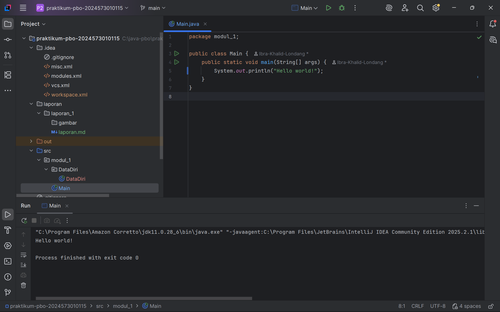

# Laporan Modul 1: Perkenalan Java dan Ekosistemnya
**Mata Kuliah:** Praktikum Pemrograman Berorientasi Objek   
**Nama:** [Ibra Khalid Londang]  
**NIM:** [2024573010115]  
**Kelas:** [TI 1A]

---

## Abstrak
Laporan praktikum ini menyajikan ringkasan dan analisis mendalam tentang konsep dasar Pemrograman Berbasis Objek (OOP), dengan fokus utama pada Java.
Laporan ini menjelaskan mengapa Java dipilih sebagai bahasa pemrograman untuk mata kuliah ini, mengulas arsitektur dasarnya, dan mendokumentasikan langkah-langkah setup lingkungan pengembangan.
Laporan ini bertujuan untuk memberikan pemahaman yang komprehensif mengenai paradigma OOP dan ekosistem Java, serta menjadi panduan praktis dalam memulai pengembangan aplikasi Java.

---

## 1. Pendahuluan
Java adalah salah satu bahasa pemrograman yang paling populer dan banyak digunakan di industri.
  Dikenal dengan filosofi "Write once, run anywhere" (WORA), Java memungkinkan kode yang ditulis di satu platform dapat dijalankan di platform lain tanpa perlu modifikasi.
  Hal ini dimungkinkan oleh arsitektur unik Java yang terdiri dari tiga komponen utama: Java Development Kit (JDK), Java Runtime Environment (JRE), dan Java Virtual Machine (JVM).

Java Development Kit (JDK) adalah seperangkat alat pengembangan yang lengkap, termasuk compiler (javac), debugger, dan tool lainnya yang esensial untuk menulis dan mengkompilasi kode Java.
JDK adalah fondasi utama bagi setiap pengembang Java, menyediakan semua yang dibutuhkan untuk mengubah kode sumber menjadi bytecode.

Java Runtime Environment (JRE) adalah lingkungan yang diperlukan untuk menjalankan aplikasi Java.
JRE mencakup Java Virtual Machine (JVM) dan Java Core Libraries yang berfungsi sebagai jembatan antara bytecode Java dan sistem operasi.
Meskipun tidak digunakan untuk pengembangan, JRE sangat penting bagi pengguna akhir yang hanya perlu menjalankan aplikasi Java.

Java Virtual Machine (JVM) adalah komponen kunci yang memungkinkan portabilitas Java.
JVM berfungsi sebagai mesin virtual yang mengeksekusi bytecode Java, menerjemahkannya menjadi instruksi yang dapat dipahami oleh sistem operasi yang mendasarinya.
Setiap platform memiliki implementasi JVM-nya sendiri, yang menjamin bytecode yang sama dapat berjalan di berbagai sistem, dari Windows hingga Linux dan macOS.
Selain itu, JVM juga dilengkapi dengan Garbage Collector yang secara otomatis mengelola memori, membebaskan pengembang dari tugas manual alokasi dan dealokasi memori.

Pemilihan Java untuk mata kuliah ini didasarkan pada beberapa keunggulan:
- Platform Independence: Berkat konsep WORA dan JVM, program Java dapat berjalan di berbagai sistem operasi.

- Strongly Typed Language: Java memiliki sistem tipe yang ketat, yang membantu mendeteksi kesalahan saat kompilasi, mengurangi kemungkinan runtime error.

- Rich Library: Java menawarkan koleksi perpustakaan yang luas untuk berbagai tugas, seperti manajemen string, jaringan, hingga konektivitas database.

- Large Community: Adanya komunitas besar dan aktif memudahkan pengembang untuk mendapatkan dukungan dan sumber daya.

- Industry Standard: Java telah menjadi standar industri yang luas, memberikan nilai tambah signifikan bagi karir profesional.
Untuk memulai pemrograman Java, kita juga membutuhkan Integrated Development Environment (IDE).
IDE seperti IntelliJ IDEA, Eclipse, atau Visual Studio Code menyediakan lingkungan terintegrasi yang menggabungkan editor kode, compiler, debugger, dan alat bantu lainnya.
IDE sangat meningkatkan produktivitas dengan fitur-fitur seperti pelengkapan kode cerdas, deteksi kesalahan real-time, dan manajemen proyek yang efisien.

---

## 2. Proses instalasi Java
### Instalasi JDK 21 (Amazon Correto)
#### Langkah 1: Akses Website Amazon Corretto
1. Buka browser web (Chrome, Firefox, atau Edge)
2. Navigasikan ke alamat: https://aws.amazon.com/corretto/
3. Klik tombol "Download Amazon Corretto" yang terletak di bagian tengah halaman
4. Anda akan diarahkan ke halaman download yang menampilkan berbagai versi yang tersedia

#### Langkah 2: Pilih Versi JDK yang Tepat
1. Pada halaman download, pilih Amazon Corretto 17 atau Amazon Corretto 21 (keduanya adalah Long Term Support version)
2. Untuk pembelajaran pemula, Corretto 17 sangat direkomendasikan karena stabilitas dan compatibility yang baik
3. Pastikan Anda memilih versi yang sesuai dengan arsitektur sistem operasi:
   - Windows x64: Untuk Windows 64-bit (paling umum)
   - Windows x86: Untuk Windows 32-bit (jarang digunakan)
   - macOS x64: Untuk Mac dengan processor Intel
   - macOS aarch64: Untuk Mac dengan Apple Silicon (M1/M2)
   - Linux x64: Untuk distribusi Linux 64-bit

##### Langkah 3: Download Installer
1. Klik pada link download yang sesuai dengan sistem operasi Anda
2. Pilih format installer:
   - Windows: File dengan ekstensi .msi (Microsoft Installer)
   - macOS: File dengan ekstensi .pkg (Package Installer)
   - Linux: File dengan ekstensi .deb (untuk Ubuntu/Debian) atau .rpm (untuk RedHat/CentOS)
3. Tunggu proses download selesai (ukuran file sekitar 200-300 MB)
4. Pastikan lokasi download mudah diakses (biasanya folder Downloads)

#### Langkah 4: Instalasi di Windows
1. Buka File Explorer dan navigasikan ke folder Downloads
2. Double-click file installer Amazon Corretto (contoh: amazon-corretto-17-x64-windows-jdk.msi)
3. Jika muncul dialog "User Account Control", klik "Yes" untuk memberikan permission
4. Pada welcome screen installer, klik "Next"
5. Baca dan setujui License Agreement dengan mencentang "I accept the terms in the License Agreement", kemudian klik "Next"
6. Pada halaman "Custom Setup", biarkan semua komponen tercentang (default installation), klik "Next"
7. Catat dengan teliti installation path yang ditampilkan (biasanya: C:\Program Files\Amazon Corretto\jdk17.x.x_xx\)
8. Klik "Install" untuk memulai proses instalasi
9. Tunggu proses instalasi selesai (biasanya 2-5 menit)
10. Klik "Finish" untuk menyelesaikan instalasi

#### Langkah 5: Verifikasi Instalasi
1. Windows: Buka Command Prompt dengan menekan Win+R, ketik cmd, tekan Enter
2. macOS: Buka Terminal dari Applications > Utilities > Terminal
3. Linux: Buka Terminal dengan Ctrl+Alt+T
4. Ketik command berikut dan tekan Enter:
```declarative
java -version
```
5. Output yang diharapkan akan menampilkan informasi seperti:
```declarative
openjdk version "17.0.x" 2023-xx-xx LTS
OpenJDK Runtime Environment Corretto-17.0.x.x (build 17.0.x+xx-LTS)
OpenJDK 64-Bit Server VM Corretto-17.0.x.x (build 17.0.x+xx-LTS, mixed mode, sharing)
```
6. Selanjutnya, verifikasi compiler dengan mengetik:
```declarative
javac -version
```
7. Output yang diharapkan:
```declarative
javac 17.0.x
```
#### Langkah 6: Setup Environment Variables (Khusus Windows)
1. Klik kanan pada "This PC" di desktop atau File Explorer, pilih "Properties"
2. Klik "Advanced system settings" di panel kiri
3. Pada dialog System Properties, klik "Environment Variables…"
4. Di bagian "System variables", klik "New…"
5. Masukkan:
   - Variable name: JAVA_HOME
   - Variable value: C:\Program Files\Amazon Corretto\jdk17.0.x_xx (sesuaikan dengan versi yang terinstall)
6. Klik "OK"
7. Cari variable "Path" di System variables, klik "Edit…"
8. Klik "New" dan tambahkan: %JAVA_HOME%\bin
9. Klik "OK" pada semua dialog yang terbuka
10. Restart Command Prompt untuk menerapkan perubahan


### Instalasi Intellj Idea CE
#### Langkah 1: Mengakses Website JetBrains
1. Buka browser web dan navigasikan ke: https://www.jetbrains.com/idea/
2. Pada halaman utama, Anda akan melihat dua pilihan: Ultimate (berbayar) dan Community (gratis)
3. Klik tombol "Download" di bawah "Community Edition"
4. Anda akan diarahkan ke halaman download yang otomatis mendeteksi sistem operasi Anda 

#### Langkah 2: Download IntelliJ IDEA
1. Pastikan tab "Community" dipilih (bukan Ultimate)
2. Sistem akan otomatis mendeteksi OS Anda dan menampilkan download button yang sesuai
3. Klik "Download" untuk memulai download
4. Ukuran file sekitar 700MB-1GB, pastikan koneksi internet stabil
5. File installer akan tersimpan di folder Downloads dengan nama seperti:
   - Windows: ideaIC-2023.x.x.exe
   - macOS: ideaIC-2023.x.x.dmg
   - Linux: ideaIC-2023.x.x.tar.gz

#### Langkah 3: Instalasi di Windows
1. Navigasikan ke folder Downloads dan double-click file ideaIC-2023.x.x.exe
2. Jika Windows menampilkan security warning, klik "Yes" atau "Run anyway"
3. Pada welcome screen, klik "Next"
4. Pilih installation directory (default: C:\Program Files\JetBrains\IntelliJ IDEA Community Edition 2023.x.x)
5. Klik "Next" untuk melanjutkan
6. Pada Installation Options, centang opsi berikut:
   - "64-bit launcher" (untuk sistem 64-bit)
   - "Add launchers dir to the PATH"
   - "Add 'Open Folder as Project'"
   - ".java" - Associate .java files
   - "Download and install JetBrains Runtime"
7. Klik "Next"
8. Pada Start Menu Folder, biarkan default dan klik "Install"
9. Tunggu proses instalasi selesai (5-10 menit)
10. Centang "Run IntelliJ IDEA Community Edition" dan klik "Finish"

#### Langkah 4: First Time Setup IntelliJ IDEA
1. Saat pertama kali membuka IntelliJ IDEA, Anda akan melihat "Welcome to IntelliJ IDEA"
2. Pada dialog "Import IntelliJ IDEA Settings", pilih "Do not import settings"
3. Klik "OK"
4. Pilih UI Theme:
   - "Light" untuk tema terang (cocok untuk lingkungan terang)
   - "Darcula" untuk tema gelap (cocok untuk mata yang sensitif)
5. Klik "Next"
6. Pada "Default plugins", biarkan semua plugin default tercentang
7. Klik "Next"
8. Pada "Featured plugins", Anda bisa skip dulu dengan klik "Start using IntelliJ IDEA"
   
#### Langkah 5: Verifikasi Konfigurasi JDK di IntelliJ IDEA
1. Pada Welcome screen IntelliJ IDEA, klik "New Project"
2. Di panel kiri, pilih "Java"
3. Pastikan "Project SDK" menampilkan Amazon Corretto yang telah diinstall
4. Jika belum muncul, klik "Add SDK" → "JDK"
5. Navigate ke folder instalasi Amazon Corretto:
   - Windows: C:\Program Files\Amazon Corretto\jdk17.0.x_xx
   - macOS: /Library/Java/JavaVirtualMachines/amazon-corretto-17.jdk/Contents/Home
   - Linux: /usr/lib/jvm/java-17-amazon-corretto
6. Klik "OK" untuk menambahkan JDK
7. Klik "Cancel" untuk keluar dari dialog New Project


### TROUBLESHOOTING UMUM
#### Problem 1: "java" command not found
Gejala: Ketika mengetik java -version di command line, muncul pesan error "java is not recognized as internal or external command"

Solusi Windows:
Restart Command Prompt setelah setup Environment Variables. Jika masih tidak berfungsi, pastikan PATH sudah diset dengan benar dan tidak ada typo dalam penulisan path.


#### Problem 2: IntelliJ IDEA tidak detect JDK
Gejala: Saat membuat project baru, tidak ada pilihan JDK atau muncul pesan "No SDK"

Solusi:

1. Buka File → Project Structure → SDKs
2. Klik + dan Add JDK
3. Browse ke folder instalasi Amazon Corretto
4. Klik OK untuk menambahkan

#### Problem 3: Installer corrupt
Gejala: Installer tidak bisa dibuka atau muncul error saat instalasi

Solusi:

1. Download ulang installer dari website resmi
2. Pastikan koneksi internet stabil saat download
3. Disable antivirus sementara saat instalasi (jika diperlukan)


### Persiapan Repository Projek
1. Install git jika belum ada (https://git-scm.com/)
2. Buatkan akun github (jika belum ada). https://github.com/
3. Buatkan sebuah repository baru dengan nama praktikum-pbo-<nim anda>. Jangan lupa checklist readme di klik, untuk membuat file readme di repo.
4. Tentukan direktori dimana anda akan menyimpan projek matakuliah ini, kemudian buka git bash dan masuk ke direktorinya dengan perintah cd <nama direktori>
5. Clone project tersebut dengan perintah git clone <url repositori>. Untuk url repositori, anda bisa dapatkan di repositori github anda. contoh nya seperti berikut:
6. Buka project yang sudah anda clone diatas dengan Intellj.
7. Buatkan file dan folder baru dengan struktur berikut di dalam repo yang sudah anda clone dengan ketentuan berikut:


### Hello World Java
1. Buat sebuah project baru di intellj dengan memilih file -> new -> project
2. Pastikan teknology, lokasi penyimpanan sesuai. Contoh:

## 3. Laporan proses pembuatan program hello world dengan java
1. Hilangkan checklist pada tulisan Create Git repository
2. Buat sebuah java class baru dan beri nama Main dengan klik kanan pada folder src pilih new -> Java Class
3. Tuliskan kode berikut:
```declarative
public class Main {
    public static void main(String[] args) {
        System.out.println("Hello World");
    }
}
```
## hasil:


---

## 4. Referensi
Correto-https://aws.amazon.com/corretto/  
Intellije-https://www.jetbrains.com/idea/

---
